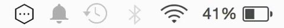

# AnyBarWebpackPlugin
[Webpack](http://webpack.github.io/) build status plugin for status bar indicator applications.



## Known apps

- [AnyBar](https://github.com/tonsky/AnyBar) on OS X
- [somebar](https://github.com/limpbrains/somebar) on Linux

## Installation

Make sure you have an application installed and running

```
npm i -D anybar-webpack
```

## Usage

Use it in your `webpack.config.js`:

```javascript
var AnyBarWebpackPlugin = require('anybar-webpack');

module.exports = {
    // ...
    plugins: [
        new AnyBarWebpackPlugin()
    ]
    // ...
};
```

If you are running status bar application on a different port than default 1738, pass port number to `AnyBarWebpackPlugin` constructor function.
